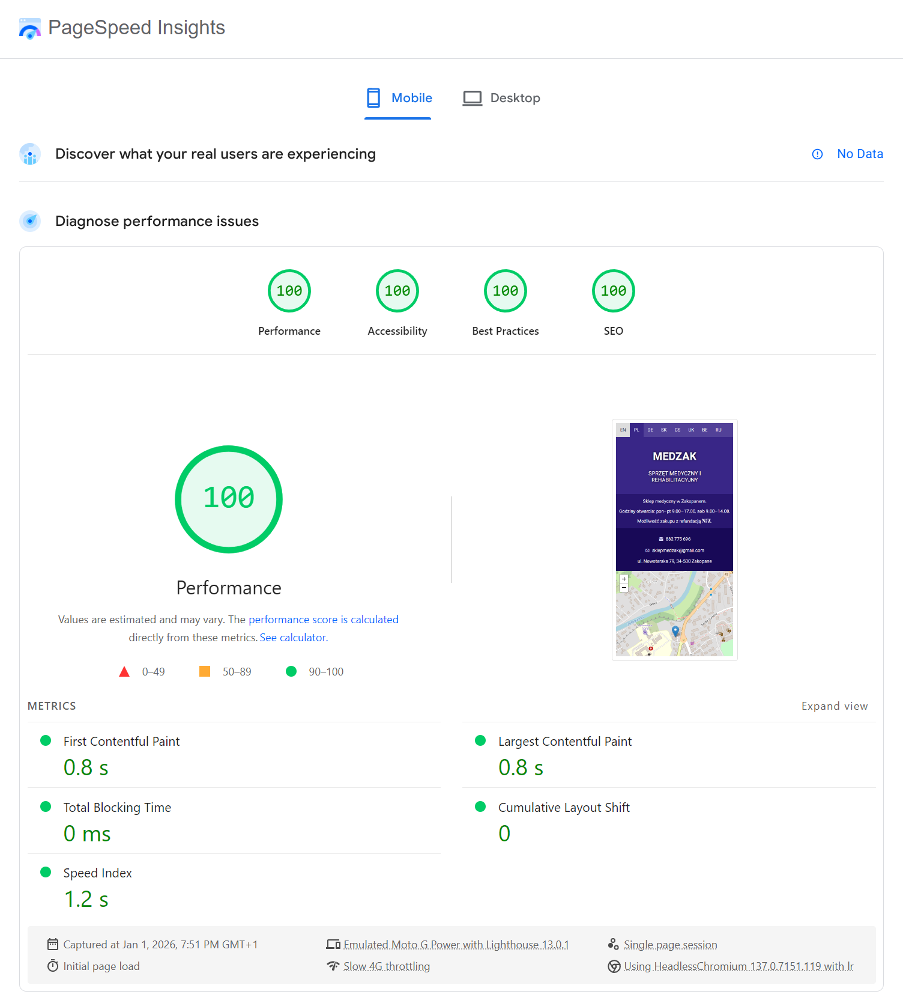
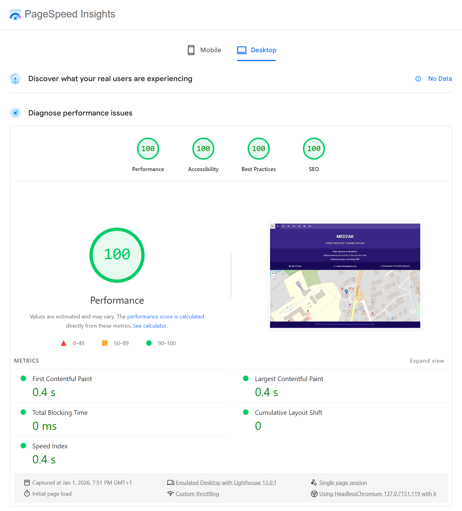

## About
Minimalistic landing page template with contact data and location map for local business point of sale.

## Features
- Responsive design
- Mobile first rendering
- Pure HTML and CSS
- No JavaScript
- No frameworks and unnecessary dependencies
- Minified code
- Scalable inline SVG
- Interactive map (iFrame with OpenStreetMap)
- Multilanguage
- Web accessible
- SEO optimized
- Privacy friendly
- Secure and reliable
- Extremely lightweight
- Ultra-fast loading
- Customizable and easy to maintain (after unminification)

## Live demo
You can view online demo [here](https://medzak.pl/).

## PageSpeed Insights score
Mobile: Performance 100/100, Accessibility 100/100, Best Practices 100/100, SEO 100/100
  
Desktop: Performance 100/100, Accessibility 100/100, Best Practices 100/100, SEO 100/100
  
Full original report [here](https://pagespeed.web.dev/analysis/https-medzak-pl/27q1ruitat).

## License
This template is in the public domain and can be freely used for any purposes unless specified otherwise.

